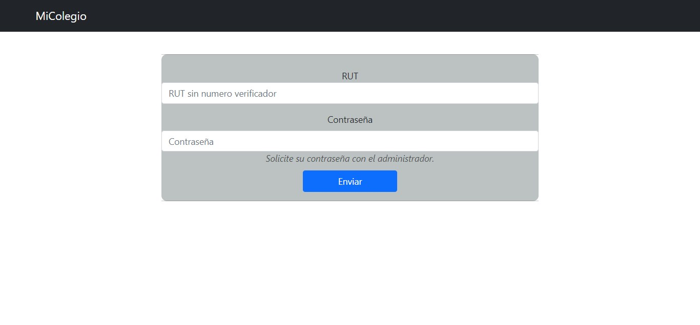
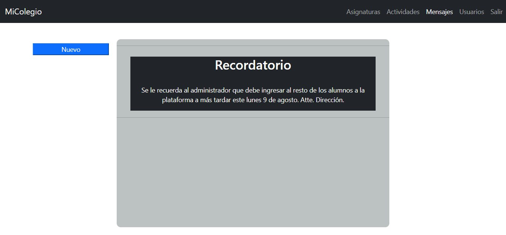
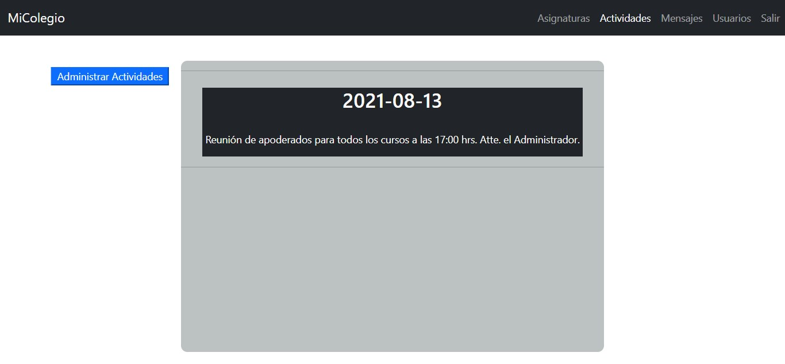
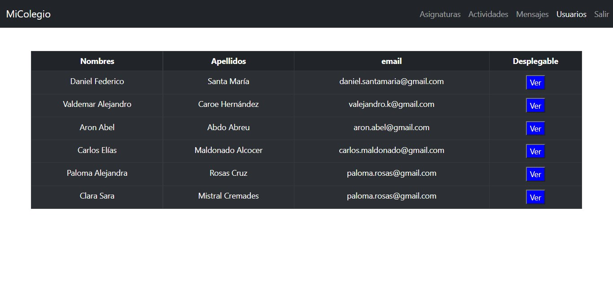

# README.MD
Tradicionalmente, los colegios han mantenido un comunicación analógica con su comunidad, informándola mediante agendas o por vía oral. El presente software centraliza la comunicación en un medio digital, consiguiendo un flujo de información más eficiente. Sobre todo en el caso de que las clases deban realizarse de forma online o semi-presencial.

## Colaboradores
[Vladimir Varela](https://github.com/VladimirVarelaH) en el frontend.  
[Diego Prokes](https://github.com/diego-prokes) en el backend.

## Contenido
El proyecto ha sido desarrollado puramente en la rama master. Se organiza en dos directorios: **frontend** y **backend**.

## Directorios
El directorio backend se estructura de la siguiente manera
**config**
Contiene la información necesaria para que la aplicación se conecte con la base de datos.
**migrations**
Contiene todas las migraciones necesarias para crear la base de datos a través de la terminal de sequelize.
**src**
Contiene el código fuente del backend. Se destacan los directorios: models y controllers. Separados de esta forma para seguir el patrón de diseño MVC y el uso de ORM con sequelize.
El directorio frontend se estructura de la forma siguiente:
**src:components**:
Almacena todos los componentes que serán renderizados en la ejecución de la aplicación.
**src:redux**:
Contiene una store, actions y reducers. Los cuales interactúan entre sí para determinar qué se renderiza y qué no en la pantalla del usuario.
**App.js**:
Aquí se ubica el router, un árbol de direcciones a las que se puede acceder en la página. Es el esqueleto de la aplicación.

Finalmente, vale la pena mencionar los fichero package.json los cuales definen las configuraciones de ejecución y las dependencias del proyecto.


## Cómo clonar el proyecto
Para clonar el proyecto, se deben solicitar los permisos al administrador del proyecto. Luego, debes ubicarte en un directorio a tu elección con la terminal y utlizar el comando:
```bash
git clone https://github.com/VladimirVarelaH/PlataformaColegio.git
```
E ingresar tus credenciales.

## Requisitos de instalación
* Nodejs v16.3.0
* npm v7.18.1
* PostgreSQL 12.7

## Instalación
**Backend**:
Lo primero que debes hacer es ubicarte con la terminal en el directorio backend y ejecutar el comando:
```bash
npm install
```
Se instalarán las dependencias del proyecto. Luego, debes ubicar el fichero package.json y eliminar las líneas:
>"type": "module",
>
>"sourceType": "module",

Posteriormente, iniciarás el servicio de postgres en tu sistema y crearás una base de datos llamada: webschool.
Con la base de datos arriba, con la terminal en backend 
Una vez que la base de datos exista en tu sistema, iniciarás el servicio de postgres y ralizarás las migraciones hacia la base de datos usando los comandos:
```bash
npx sequelize db:migrate
```
Una vez que las migraciones se hayan realizado, debes volver a agregar:
>"type": "module",
>
>"sourceType": "module",

al fichero package.json del backend.
Finalmente, podrás iniciar el servidor web que utliza la aplicación con el comando:
```bash
npm start
```
**Frontend**
Debes ubicart con tu terminal en el directorio frontend y ejecutar el comando:
```bash
npm start
```
El tiempo que tardará la aplicación en ejecutarse en tu navegador, dependerá del computador desde el cuál ejecutaste el comando. Puede llegar a tardar varios minutos.

## Recomendaciones
Se recomienda que se ingresen los camandos del fichero inserciones_tituladas.txt, ubicado en el directorio inserciones bd para poblar la base de datos y así, hacer pruebas en la aplicación.
Puede hacer login con el usuario de rut 30109691 y contrasenia 30109691, llamado: Daniel.

## Previsualizaciones
Se han agregado algunas imagenes que permiten previsualizar la aplicación.

**Login**


**Mensajes**


**Actividades**


**Usuarios**
